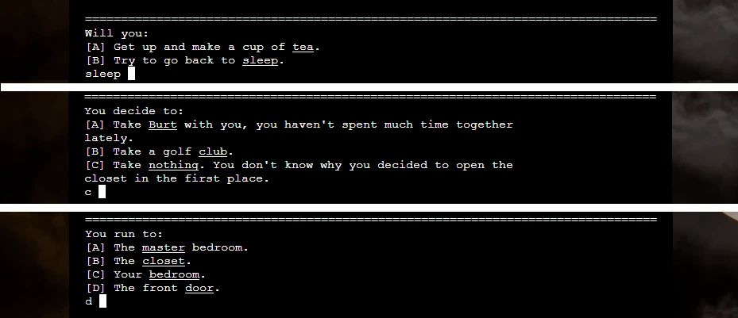

# Hide & Seek

Hide & Seek is a horror-themed, choose your own adventure game. It is targeted at users who would like to play an interactive story where their decisions will influence how the game story plays out.

Created with Python, Hide & Seek is inspired by classic adventure games where the user interacts with the game by entering commands. And like a classic choose your own adventure story, the choices the user makes when prompted effect the outcome of the game. There are multiple different endings decided by the choices made throughout the game.

The live site can be found here: [Hide & Seek](https://ci-pp3-hide-and-seek.herokuapp.com/)

# Table of Contents

- [User Experience](https://github.com/SJECollins/ci-pp3-hide-and-seek#user-experience)
- [Features](https://github.com/SJECollins/ci-pp3-hide-and-seek#features)
- [Design](https://github.com/SJECollins/ci-pp3-hide-and-seek#design)
- [Technologies Used](https://github.com/SJECollins/ci-pp3-hide-and-seek#technologies-used)
- [Testing](https://github.com/SJECollins/ci-pp3-hide-and-seek#testing)
- [Deployment](https://github.com/SJECollins/ci-pp3-hide-and-seek#deployment)
- [Credits](https://github.com/SJECollins/ci-pp3-hide-and-seek#credits)

# User Experience

## User Story

As a user,
- I would like to understand how to interact with the game
- I would like to be able to make decisions within the game that change the story
- I would like the options I have to be clearly presented to me
- I would like to be able to replay the game when I reach an ending

# Features
## Title Screen

The title screen features the name of the game in ASCII using pyfiglet. It gives the user an initial prompt to press enter to begin the game.

Should the player quit while playing the game, they are returned to the title screen.

## Introduction

The introduction screen gives the user three prompts. The first is a prompt to enter their name. This is trimmed and captilised, and stored in the username variable to be used throughout the game.

The game then gives a second prompt, including the username to provide feedback to the user that their input is recorded. This second prompt asks a simple yes/no question to encourage the user to type a response. If the user agrees to play the game, they are given simple instructions to input either the letter a prompt or underlined keywords.

The third prompt asks if they are ready to start. It has the typical layout for prompts featured in the game. At this point, it is expected the user understands how to interact with the game.

## User Interaction

Throughout the game, the user is prompted to make decisions. They are typically prompted with two options, but there can be as many as four. Also, as explained in the introduction, the user can enter "quit" at any point to return to the title screen even though it is not typically presented as an option.

These decisions that the user makes during the story will effect how the story plays out and the overall outcome.

## End Screen

The end screen features when the user reaches one of the endings of the story. "The End" is displayed in ASCII using pyfiglet. After a brief pause the user is then presented with an option to play again - which brings them back to the starting room - or to quit to the title screen.

## Future Expansion

1. __Additional Stories__. Similarly to my PP2 where the idea of a game was expanded into a small "arcade" site containing multiple games, this app could be expanded into a "library" of choose your own adventure stories with a main screen offering the user a list of stories to choose from.
2. __Save Game__. Save and load functionality so a user can save and restart as suits them. However, the game is quite short at the moment and this functionality would also allow "Save Scumming" so there would be less risk associated with each decision a user makes.
3. __Additional/Improved Graphics__. The current ASCII graphics in the game are quite limited as they were mainly included as an example of using a dictionary to store multiline strings and then printing from them.

# Design

The game was inspired by classic text adventure games and choose your own adventure books. It is told in a second-person narrative to immerse the player as they are the main character in the story. There is limited ASCII art to illustrate the story and a slow printing effect for the story text.

The game is written as a series of functions which include the choices, changes to global variables and call the next function depending on input. However, there are a lot of examples online of text adventures that use dictionaries to store the details of rooms and a series of if/else statements. This was considered, however, in this case the user does not have freedom to move back and forth between rooms or revisit previously made decisions.

## Story

Hide & Seek is a small horror game. The story design is inspired by classic choose your own adventure books. The user moves one way through the story and is prompted to make decisions at important branches. These decisions alter variables or call different functions within the code which changes how the story plays out. It is not possible to see the entire story in one play through. 

Unlike some text adventure games, a user cannot go back and revisit a decision, they have to continue with the decisions they have made until the story ends. For example, if they chose to pick up one object rather than another, they can't go back and change their mind. To find all the endings or to see alternative routes through the story, the game has to be played multiple times. 

The design is also loosely inspired by the games designed by Roberta Williams and others from that era. Classic Sierra games are often criticised for being "unfair" as the user could easily miss an important pick up or make an incorrect decision without realising it as they weren't always given the information they needed to know or told what they needed to do. The user was expected to fail and try again until they figured out what game wanted from them. 

While it can be frustrating to lose based on what seems like arbitrary decisions, I felt as though this logic behind the game design worked quite well in a horror game. On first playthrough, the user doesn't know what will happen and so can only make decisions arbitrarily based on minimal information and then watch how it plays out. Hopefully, the user will feel this is a challenge and be inspired to play again and make different, more informed decisions upon completing the game for the first time.

## Graphics

The game is limited graphically as it is designed to be played in the terminal. However, to provide a slightly better user experience some ASCII art has been implemented.

Images.py contains a dictionary of ASCII art which is printed to the terminal where appropriate to illustrate the game. Using pyfiglet, the title on the title screen and "the end" at the end of the game are also printed using an ASCII shadow "font".

## Slowprint

A slowprint function was used to create an effect where it appeared as through the story was being printed to the terminal as the user read it. This is to try to add a little more immersion to the story. It also serves to give the user time to read the text on screen before the input prompt appears. 

Before the slowprint function, time.sleep() was used instead to delay progression of the story where necessary. However, the effect was such that text appeared quite abruptly and the screen felt very static while the user read the story. 

Using a combination of slowprint and time.sleep(), where necessary, the flow of the story was improved.

## Flowchart

Game Flowchart

# Technologies Used

- [HTML5](https://en.wikipedia.org/wiki/HTML5): mark-up language.
- [CSS3](https://en.wikipedia.org/wiki/CSS): styling.
- [Python](https://en.wikipedia.org/wiki/Python_(programming_language)): programming language.
  - Libraries:
    - Pyfiglet: to create ASCII titles.
    - OS: for the clear terminal function.
    - Time: for time.sleep().
- [GIT](https://git-scm.com): for version control.
- [GitHub](https://github.com): for host repository.
- [Gitpod](https://www.gitpod.io): online IDE.
- [Inkscape](https://inkscape.org): to create the favicon.
- [Diagrams.net](https://www.diagrams.net/)

# Testing

## [PEP8 online check](http://pep8online.com/)
- run.py:
  - 
- images.py:
  - 

## HTML and CSS Validation
Though the HTML and CSS was only slightly altered from the template for the project, testing was included for completeness.
- [HTML Validator](https://validator.w3.org/)
  - 
  - [Link to HTML Validator](https://validator.w3.org/nu/?doc=https%3A%2F%2Fci-pp3-hide-and-seek.herokuapp.com%2F)

- [CSS Validator](https://jigsaw.w3.org/css-validator/)
  - 
  - 

      
    

## Lighthouse
Also for completeness, the site was tested with Lighthouse. This was primarily to judge performance, best practices and SEO. The use of jQuery was flagged for security issues under best practices. The result for accessibility cannot be considered a true result for the app.

## Browser Compatibility
The website was tested on:
- Chrome Version 101.0.4951.67
- Firefox Version 101.0.4951.67
- Edge Version 101.0.1210.53
- Safari Version 14.1

The website was not designed for mobile devices.

## Testing Functionality

The game was tested throughout production when each new function was created. Following deployment, the game was replayed multiple times through the different decisions to ensure it functioned correctly.

## Testing User Stories

- "As a user, I would like to understand how to interact with the game"
  - The title screen features a prompt to press enter to begin. This is the user's first introduction to the core mechanic.
  - On the the introduction screen, the user is first asked to enter their name. Their input is then trimmed, capitalised an returned to them in the second prompt. This indicates to the user that their inputs are being taken in and used by the program.
  - The second prompt explains the mechanics and features a simple yes or no question, and the user is provided a different response depending on how they answer which shows them that their input does effect how the program behaves.
  - The third prompt gives the user an option to respond either with a letter or keyword as they will be doing during the game.
  - All these prompts are very basic and subtle ways to introduce the user to the gameplay featured throughout. They are intended to be simple enough for users who aren't familiar with classic adventure games to have basic understanding of how to play.
- "As a user, I would like to be able to make decisions within the game that change the story"
  - The core gameplay mechanic is prompting the user to make a decision that effects the course of the story.
  - There are 15 separate decisions within the story. Not all decisions are present in every playthrough of the story. The user can reach an end screen in as few as 3 prompts.
  - Also, there is some flavour text within the story that depends on the choice a user makes but does not effect the outcome of the game. For example, if the user collects Burt but not the slippers, there is a line of text upon reaching the kitchen that says the player hugs Burt when they walk on the cold tiles. This is different depending on if they don't have Burt or are wearing slippers.
- "As a user, I would like the options I have to be clearly presented to me
  - The prompts for the user are separated from the story by a line of "=" and without slowprint to differentiate them from the narrative.
  - The prompts are presented in an alphabetized list. Late in development the format was changed from "A." to "[A]" to further highlight the letter as an option.
  - The keywords are underlined. There is no underlined text in the narrative of the game.
  - The options are prefaced with text such as "You will:" or "You feel compelled to:" before the list to further indicate the user has to make a choice. 
- "As a user, I would like to be able to replay the game if I want when I reach an ending"
  - The play_again function is called after a brief pause. It gives the user an option to replay, which will bypass the title screen and bring them back to the first room so they can quickly replay and try another path.

## Fixed Bugs
- On initial deployment, the game did not run because pyfiglet was not included in requirements.txt
  - "pyfiglet==0.8.post1" was included in requirements.txt and the app deployed again and then ran correctly.
- On intial deployment, the game always called the wake_win function on going back to bed if the user picked up the teddy, fell over the stool and went back to their bedroom.
  - The teddy was not removed from the pick_ups list when the user fell over the stool. pick_ups.remove("teddy") was added to correct.
- Background image for the website was not displaying when added.
  - Heroku does not display images when linked normally. Changed link to GitHub file and now displays correctly.

## Known Bugs

- The app does not work on mobile devices. 
  - It was not designed to work on mobile devices as it is not a requirement for the project. As of yet, I have not come across a way to make it function on my iPhone.

# Deployment

## Steps to deploy site using Heroku:
- On the Heroku dashboard, select "New" and click "Create new app"
  - Create a unique app name
  - Select your region
  - Click "Create app"
- Go to the settings tab:
  - Scroll down to the config vars section and select "Reveal Config Vars"
  - Add necessary config vars
  - In this case, in the key field enter "PORT" and the value field enter "8000"
  - Click "Add"
  - Scroll down to Buildpacks and click "Add buildpack"
  - Add the necessary buildpacks.
  - In this case, select "python" and click "Save changes"
  - Then, select "node.js" and click "Save changes"
- Go to the Deploy tab:
  - Select GitHub and confirm connection to GitHub account
  - Search for the repository and click "Connect"
  - Scroll down to the deploy options
  - Select automatic deploys if you would like automatic deployment with each new push to the GitHub repository
  - In manual deploy, select which branch to deploy and click "Deploy Branch"
  - Heroku will start building the app
- The link to the app can be found at the top of the page by clicking "Open app"

The live site can be found here: [Hide & Seek](https://ci-pp3-hide-and-seek.herokuapp.com/)

## Steps to clone site:
- In the GitHub repository, click the "Code" button.
- Select "HTTPS" and copy the URL.
- Open Git Bash and navigate to the repository where you would like to locate the cloned repository.
- Type "git clone" followed by the copied URL.
- Press enter to create the clone.

# Credits

- The code to take and format the user input was adapted from a conversation with my mentor.
- The code to clear the terminal is based on [this article from Geeks for Geeks](https://www.geeksforgeeks.org/clear-screen-python/)
- The code for the slowprint function is from [this Replit page](https://replit.com/talk/learn/The-Slow-Print/44741)
- The code for centering the ASCII art printed from the dictionary comes from [this Stack Overflow thread](https://stackoverflow.com/questions/51606897/ascii-characters-text-align)
- The background image for the page is by [Brett Sayles on Pexels.com](https://www.pexels.com/photo/photo-of-a-full-moon-3910141/)

# Acknowledgements
I'd like to thank my mentor, Brian Macharia, for providing excellent advice and feedback during this project.